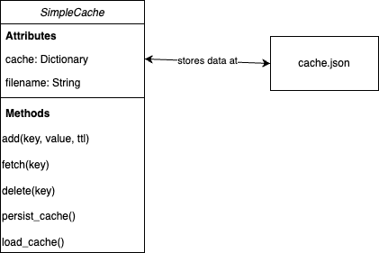

# Simple Cache



The `SimpleCache` class interacts with two main components: a file (for persistence) and the in-memory dictionary (cache). There's a bidirectional interaction between the cache and the file, where the cache can be saved to and loaded from the file.

## Running

```
git clone https://github.com/eyalrosen20/snc-simple-cache.git
cd snc-simple-cache
python simple_cache.py
```